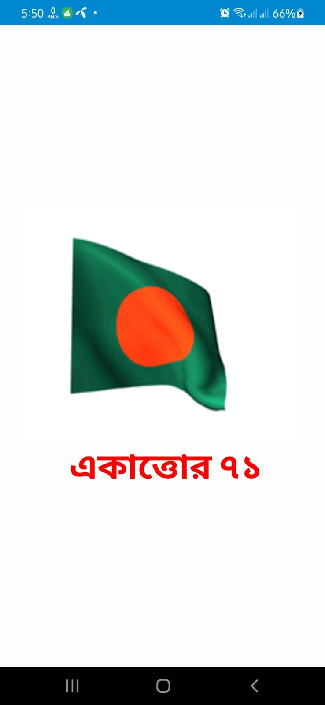
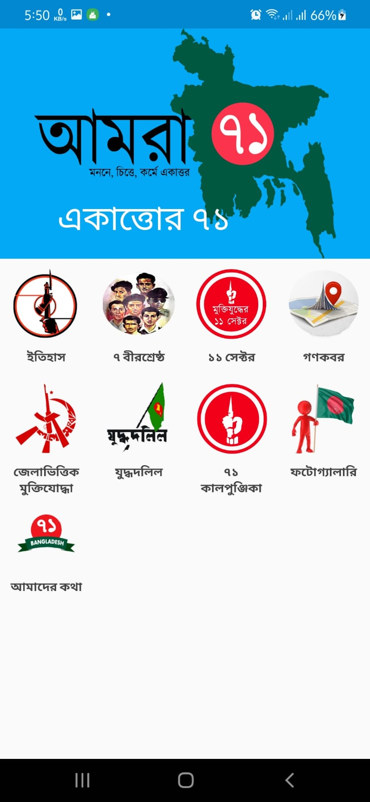

# Ekattor Android Application 
we developed the ekattor71 Android application for our academic project to fulfill the requirement of the 3rd-year 2nd semester. This application is based on the liberation war between Pakistan and Bangladesh (East Pakistan). Our main purpose is to develop this app to put all information so that people know accurate information about the war.
## We divide whole information in some sub-section
### Splash screen and Dashbord
| | |
|------------------------------------|-------------------------------| 

